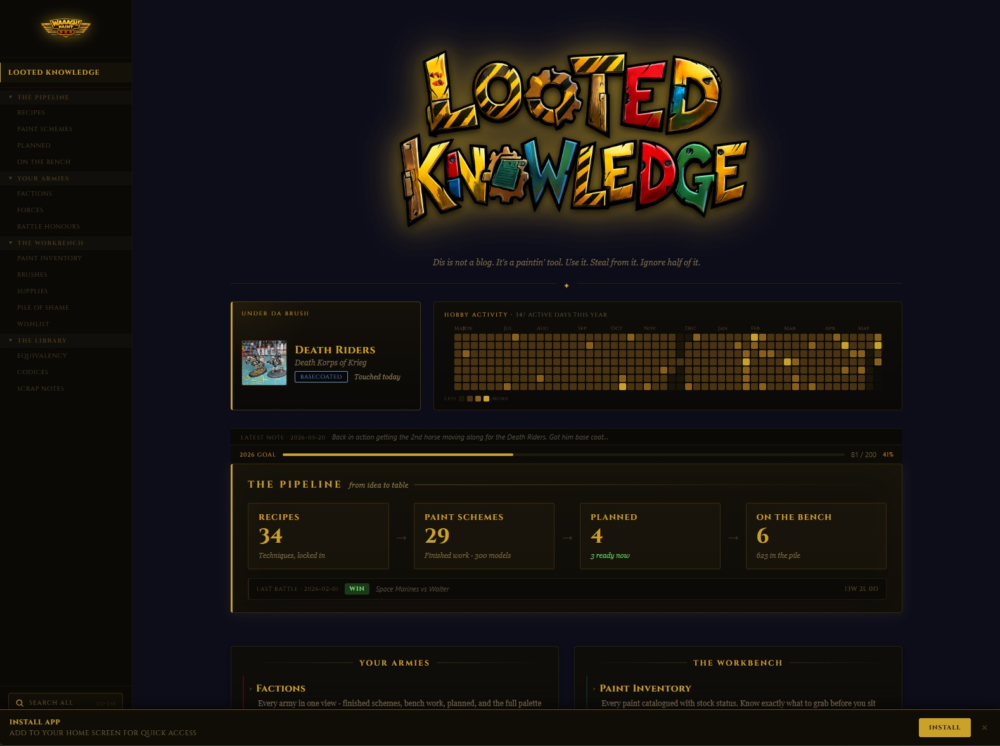
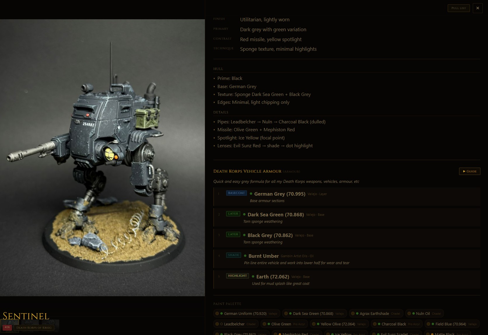
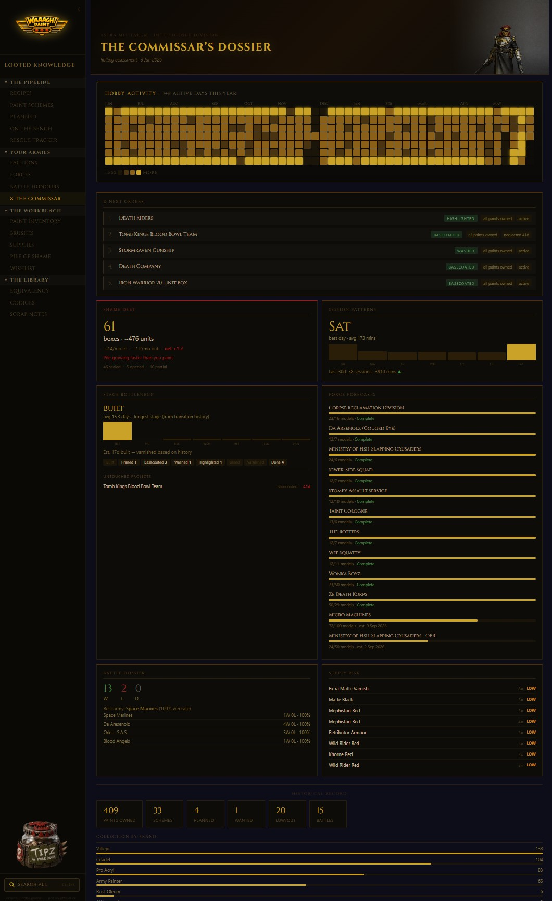
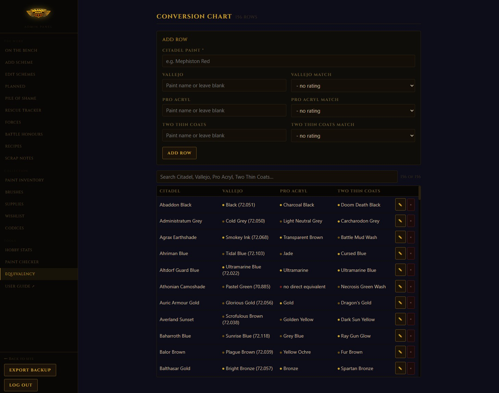
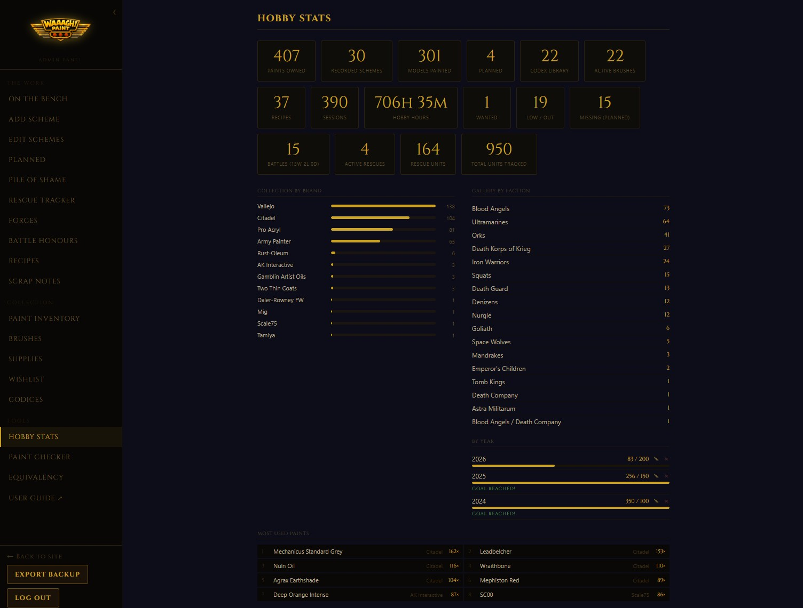

# Waaagh! Paint



A personal Warhammer hobby paint collection manager. Flat-file PHP - no database, no framework,
no dependencies beyond a PHP host. Drop it on any shared host and go. Navigation lives in a
collapsible left-rail sidebar grouped into four sections.

**[Live Site](https://waaagh.co)** &nbsp;&nbsp; [](https://www.paypal.com/donate/?business=FQZFP5JNEGGFY&no_recurring=1&item_name=Tip+jar&currency_code=USD)

> **Work in progress.** This is a personal tool shared as-is with the Warhammer hobby community.
> Features are added when they're needed - totally out of the blue as I think them up. 
> Bugs may exist. Most probably. No support is guaranteed.
> Use at your own risk. 

## Warpaint Mode Screenshot



## The Commissar



# Admin panel



## Admin panel - Hobby Stats



---

## What it does

- **Paint Catalog** - browse the full catalog of all supported paint brands, filter by brand /
  colour / layer, and import the paints you own in one click - hex color values pre-populated
  from the bundled `inventory/paint_hex.json` reference so your colour wheel works from day one.
  Already-owned paints are greyed out so you can see what you still need to add. Accessible via
  `catalog.php` (same admin password); linked from the admin quicknav
- **Paint Inventory** - track every paint you own with stock level (normal/low/out/wanted), hex
  color swatch, quality rating, and freeform notes; **Flagged filter** instantly shows only
  low/out/wanted paints so you know what to restock before sitting down to paint; **Restock List**
  opens a full-screen shopping list (Out / Low / Wanted, grouped by brand) with Print and Copy -
  also accessible in one tap from the landing page flagged count; **Colour Wheel** plots every
  chromatic paint you own as a dot on a hue wheel so you can see coverage gaps at a glance -
  toggle via the Wheel button in the controls bar or share a direct `?tab=inventory&wheel=1` link;
  **Colour Harmony Advisor** - activate Harmony mode on the wheel, click any paint, and see all
  five harmony types (Complementary, Triadic, Split, Analogous, Tetradic) with coloured arcs on
  the ring and a side panel listing the best owned paints for each harmony position, temperature
  analysis (warm/cool/neutral), and role suggestion (Shadow/Foundation/Highlight/Transition);
  click any suggestion swatch to pivot the analysis to that paint
- **Public Showcase** - a password-free portfolio page (`showcase.php`) showing only the
  models you hand-pick. In admin, click the ★ button on any gallery entry to add it; for
  multi-photo entries a thumbnail strip appears so you can choose which individual photos
  show as separate cards. Each selected photo becomes its own masonry card on the showcase
  page - clicking opens the full lightbox. Enable with `SHOWCASE_PUBLIC = true` in
  `config.php`. Off by default
- **Paint Schemes** - gallery of finished models with photos, color tagging, a pull-sheet
  checklist for repainting (missing paints show a nearest-owned color suggestion via RGB
  hex distance), **Scheme Doctor** (◎ Harmony button on each card) analyses the scheme's
  colour harmony type, temperature distribution, shadow/highlight temperature checks, and
  missing harmony roles with owned paint suggestions, and **Warpaint Mode** - a full-screen focused reference overlay with large
  imagery, full recipe step detail (technique badge, swatch, stock dot, mix paint with its
  own swatch and stock indicator, ratio, brush recommendation), nearest-owned suggestions
  for missing paints, and a stock-aware paint palette - designed for use at arm's length
  while you actually paint
- **Planned Schemes** - wishlist of future projects with readiness tracking (Ready / Almost /
  Needs Work) and a shopping list for missing paints
- **On the Bench** - active WIP projects with stage tracking, session logging, and WIP photos
- **Recipe Library** - reusable step-by-step painting techniques referenced from schemes and
  bench projects
- **Factions** - automatic per-army rollup of schemes, recipes, bench work, and paint palette
- **Forces & Rosters** - group painted schemes into named game rosters with readiness progress
- **Battle Honours** - log every game played with result, opponent, army, mission, and notes; W/L/D record shown on force cards
- **The Commissar's Dossier** - tactical intelligence briefing mined from all your data: next painting orders scored by stage and readiness, shame pile velocity, best painting day-of-week, stage bottleneck analysis, force completion forecasts, battle win rates per army, and supply risk flagging for high-use paints running low
- **Campaign Honours** - 37 milestones unlocked from your own data across 11 categories: models painted, bench sessions, bench completions, battles, forces, recipes, paints owned, shame pile, rescues, scrap notes, and codices. Colour-coded medal strip on The Commissar tab between the hero and the intelligence grid. Locked milestones shown dim so you always know what to aim for next
- **Pile of Shame** - track unbuilt boxes; promote to Planned or Bench when ready
- **Rescue Tracker** - track eBay finds and second-hand minis through bidding, shipping, receiving, stripping, and prep before they hit the bench; before-photos capture condition on arrival; model counts feed into total ownership stats; promote to Bench or Shame when ready
- **Hobby Wishlist** - paints, models, brushes, and books to buy; mark ordered/in transit
- **Brush Inventory** - track brush condition (Prime / Workhorse / Retired)
- **Supplies Inventory** - track hobby supplies (palettes, wet palettes, mats, lamps, etc.) with condition cycling
- **Colour Theory of the Day** - daily-seeded landing page card that picks a random paint from your inventory and analyses it through a randomly chosen harmony type. A mini colour wheel shows the selected paint (gold arc) alongside the harmony positions (coloured arcs) and best owned matches as dots. Refreshes each calendar day; stable throughout the day
- **Waaagh! Index** - momentum gauge in the Admin Stats section scoring your rolling 7-day activity across sessions, bench work, and journal entries; five states from DOZIN' to FULL WAAAGH!! with a "Dis Week" activity summary beneath it
- **Equivalency Search** - Citadel vs Vallejo vs Pro Acryl conversion table with owned-paint dots
- **Codex Library** - optional army book and supplement tracker
- **Scrap Notes** - optional freeform hobby journal with @mention linking to schemes and recipes

All features beyond Paint Inventory and Schemes are **opt-in** - they only appear once you
create the relevant data file via the Admin panel. Start simple and grow into the rest.

---

## Requirements

- PHP 7.4 or newer (no extensions required beyond the default install)
- Write access to the `data/` and `img/` directories on the server
- That's it

---

## Getting PHP (if you don't have a host yet)

You have a few options depending on what you want to do:

**Local use (your own computer)**

The easiest way is [XAMPP](https://www.apachefriends.org/) - a free, one-click installer that
gives you Apache + PHP on Windows, Mac, or Linux. Install it, drop the Waaagh! Paint files into
the `htdocs` folder, and open `http://localhost/waaagh-paint/` in your browser. No internet
connection required once installed.

**Shared web hosting (accessible anywhere)**

Any budget shared host that supports PHP 7.4+ will work - this covers virtually all of them
(Namecheap, DreamHost, Hostinger, SiteGround, etc.). Upload the files via FTP or cPanel File
Manager. No database or special server configuration needed.

**Self-hosted VPS or home server**

Install PHP via your package manager (e.g. `apt install php libapache2-mod-php` on Ubuntu) and
point a virtual host at the folder. The app has no special requirements beyond PHP itself.

---

## Quick Start

1. Upload all files to your PHP-enabled web host
2. Copy `config.example.php` to `config.php`
3. Edit `config.php` - set a strong admin password, your site name/domain, and optionally a
   GA4 Measurement ID
4. Navigate to `admin.php` in your browser and log in
5. Scroll to **Paint Inventory** and click **Import from CSVs** to get started - a sample Two
   Thin Coats entry is included. Add your own paints manually, or build a CSV first (see below).
6. Visit `index.php` to see the front-end collection view

---

## Building Your Paint List from a CSV

The fastest way to bulk-load a collection is to create a pipe-delimited CSV and drop it in the
`inventory/` folder, then import from admin.

**Format** - five pipe-delimited fields, one paint per line:

```
Brand | Name | Color | Hue | Layer
```

- **Brand** - your paint brand name (e.g. `Citadel`, `Vallejo`, `Army Painter`)
- **Name** - the paint name exactly as printed on the pot
- **Color** - broad colour category: `White`, `Grey`, `Black`, `Brown`, `Red`, `Orange`,
  `Yellow`, `Green`, `Blue`, `Purple`, `Pink`, `Metallic`, `Wash`, `Shade`, `Contrast`,
  `Ink`, `Effect`, `Medium`, `Texture`, `Primer`, `Pigment`, `Fluid`, `Utility`,
  `Fluorescent`, `Special`, or `Transparent`
- **Hue** - a short descriptive variant, e.g. `Pure White` or `Warm Earth`
- **Layer** - paint type or product line, e.g. `Base`, `Contrast`, `Shade`, `Air`,
  `Technical`, `Metallic`, `Model Color`, `Speedpaint`

**Example:**

```
Citadel | Mephiston Red | Red | Base Red | Base
Citadel | Agrax Earthshade | Brown | Warm Brown | Shade
Vallejo | Sunny Skin Tone | Pink | Warm Skin | Model Color
Army Painter | Speed Primer Black | Black | Pure Black | Primer
```

Blank lines between colour groups are fine - the parser skips rows with fewer than five
non-empty fields. Name your file anything ending in `.csv` and place it in `inventory/`.
You will need to register it in `admin.php` inside `loadPaintsFromCsvs()` (a one-line
addition) before it appears in the import.

---

## Documentation

A full user guide is bundled with the app at `guide.php`. It covers every tab and every admin
section in detail - how each feature works, what the fields mean, and tips for getting the most
out of it. Open it from the **User Guide** link in the admin quicknav bar (you need to be logged
in to access it).

---

## Configuration

All instance-specific settings live in `config.php` (which you create from the example and is
never committed to git):

| Setting | Description |
|---|---|
| `SITE_TITLE` | App name shown in the browser title |
| `SITE_DOMAIN` | Display domain shown in the footer |
| `SITE_AUTHOR` | Your name shown in the footer |
| `SITE_EMAIL` | Contact email shown in the footer |
| `SITE_URL` | Full URL with trailing slash (used for Open Graph meta tags) |
| `ADMIN_FILENAME` | Filename of the admin panel (default: `admin.php`). Rename the file and set this to match for security. |
| `ADMIN_PASSWORD` | Password for the admin panel - change this before deploying |
| `GA4_ID` | Google Analytics 4 Measurement ID (e.g. `G-XXXXXXXXXX`); leave empty to disable |
| `HERO_IMAGE` | Web-relative path to the landing page mast image (default: `img/looted.png`) |
| `SITE_TAGLINE` | Tagline text beneath the mast image on the landing tab |
| `SHOW_HEATMAP` | `false` to hide the Hobby Activity heatmap on the landing page |
| `SHOW_WC_NEWS` | `false` to hide the Warhammer Community news widget |
| `SHOW_COMMISSAR` | `false` to hide The Commissar's Dossier tab entirely |
| `SHOWCASE_PUBLIC` | `true` to enable the public portfolio page at `showcase.php`; `false` (default) returns 403 |
| `SHOWCASE_TITLE` | Override the page title shown on `showcase.php`; defaults to `SITE_TITLE` if blank |
| `SOCIAL_INSTAGRAM` | Full URL to your Instagram profile; leave blank to hide the icon |
| `SOCIAL_FACEBOOK` | Full URL to your Facebook page; leave blank to hide |
| `SOCIAL_THREADS` | Full URL to your Threads profile; leave blank to hide |
| `SOCIAL_YOUTUBE` | Full URL to your YouTube channel; leave blank to hide |

---

## Data Files

All data lives in flat JSON files under `data/`. These are **not** included in the repository
(they contain your personal hobby data). The app creates them automatically via the Admin panel.

| File | Created by |
|---|---|
| `data/paints.json` | Import from CSVs or Add Paint in admin |
| `data/models.json` | Gallery entries in admin |
| `data/planned.json` | Planned Schemes in admin |
| `data/brushes.json` | Start Brush Inventory button |
| `data/bench.json` | Start Workbench button |
| `data/recipes.json` | Start Recipe Library button |
| `data/books.json` | Start Codex Library button |
| `data/journal.json` | Start Scrap Notes button |
| `data/shame.json` | Start Pile of Shame button |
| `data/wishlist.json` | Start Hobby Wishlist button |
| `data/forces.json` | Start Forces & Rosters button |
| `data/battles.json` | Start Battle Honours button |
| `data/supplies.json` | Start Supplies Inventory button |
| `data/rescues.json` | Start Rescue Tracker button |

`inventory/paint_hex.json` ships with the app and contains pre-seeded hex values for all bundled
paint brands. It is used by `catalog.php` to populate swatches during import and can also be
used as a hex seed (Admin → Paint Inventory → Apply Hex Seed). Update it by running the
extraction script after adding new paints with known hex values.

`widget.php` is a lightweight public endpoint returning rolling hobby stats as JSON - 7-day
bench minutes, hobby streak, models painted this year, annual goal progress, active bench
project snapshot, and pile of shame counts. Used by the companion Android home-screen widget
([WaaaghWidget](https://github.com/waaagh-co/waaaghWidget)).

`api.php` is an authenticated endpoint (key = admin password) used by the companion Android
app ([WaaaghQuick](https://github.com/waaagh-co/waaaghQuick)) for quick data entry: session
logging, shopping list retrieval, and marking paints as purchased.

Model photos go in `img/models/`; bench WIP photos go in `img/bench/`; rescue before-photos go in `img/rescues/`. All are excluded from git and created automatically on first use.

---

## Multiple Instances

The app is fully portable - all paths use `__DIR__`, all web paths are relative, no hardcoded
domain anywhere in PHP. To run a second instance for another user: copy the files, change
`ADMIN_PASSWORD` in their `config.php`, delete the `data/` JSON files, and they start fresh
with their own inventory.

---

## License

**Polyform Noncommercial License 1.0.0**

Free for personal and community use. **Commercial use of this software is not permitted.**

This means you can:
- Use it for your own hobby tracking
- Share it with friends and the community
- Fork it and make changes for personal use
- Self-host it for free for yourself or a small group

This means you cannot:
- Sell the software or a hosted version of it
- Use it as part of a commercial product or service
- Use it to generate revenue

See [LICENSE](LICENSE) for the full legal text.

---

## Contributing

Bug reports and pull requests are welcome. By submitting a contribution you agree your changes
are released under the same Polyform Noncommercial License.

Please keep the spirit of the project: flat-file, dependency-free, easy to self-host.

---

## Author

**Waaagh! Paint** by Ray Larose  
nob@waaagh.co  
Version 0.9.0-rc.1 - 2026

---

## Disclaimer

This project is not affiliated with or endorsed by Games Workshop. Warhammer, Warhammer 40,000,
and all associated marks are trademarks of Games Workshop Ltd. Paint brand names (Citadel,
Vallejo, Pro Acryl, Two Thin Coats, Army Painter, etc.) belong to their respective owners.
